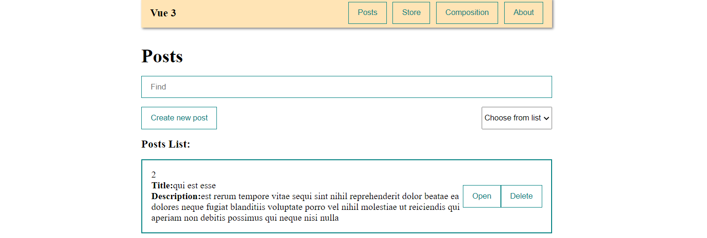

# Done (React Posts List App)

`React`, `React-router-dom`, `Axios`, `React Transition Group`, `Intersection Observer API`

https://youtu.be/GNrdg3PzpJQA

##### DEPLOY TO

https://posts-ulbi.netlify.app

---

This app was bootstraped based on the template provided by [`create-react-app`](https://github.com/facebook/create-react-app)
